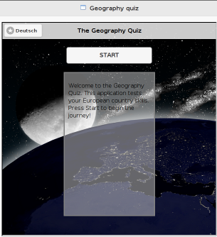
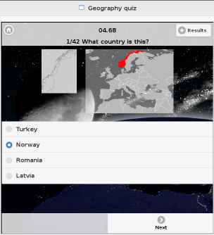
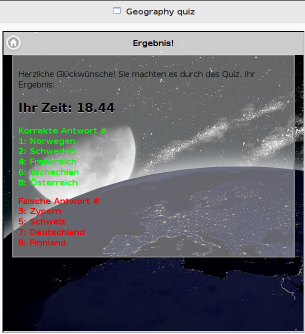

## Geography Quiz Widget

By Ondrej Blazek and Cecilia Ritzén

### Description 

The geography widget is a geography quiz that examines knowledge of the European countries. The target group is primary school students. The quiz should provide a good way to check basic geography skills fast and entertaining.

The user is for every question provided with a picture of the country and where the country is headed on the European map. The multiple choice answers are randomly given for every question. When all questions are answered the result page is displayed, where the user can see the right and wrong answers together with how long it took to complete the quiz. The user gets the opportunity to retake the quiz to improve the results.

### Screenshots 
#### Home Page

#### Start Page

#### Results

### Used APIs 

- ServerAPI through Helper module
- Public APIs for each module in the ModularMVC framework
- External JQuery plugin for the runner/stopwatch

### Dependencies 
The widget has got three packages installed via Bower. They are necesseary in order for the widget to behave as intended:
- ModularMVC. See chapter Structure of Modules for more info.
- jquery. JavaScript library for functions, events, effects.
- jquery-mobile-bower. For creating a responsive user interface for mobile devices.

### Structure of Modules
This widget is implemented using ModularMVC framework. This means that the following modules are implemented as support for the MVC framework:
- Controller. The logic layer that controls what is happening in the widget. Retrieves JSON data, and contains functions to control the question procedure. Randomization of answers for every question, and control of which answers the user chooses. 
- Model. The data layer for application data. Saves JSON data about the countries, that then can be used by the other application layers.  
- View. The presentation layer that deals with the HTML and user events. Communicates with the controller about event handlings in the widget.
- Helper for language module and widget module.

####Widget Specific Modules
- Language module. The module allows controlling the language settings in the widget. The user can choose to set the language into German or English.
- Widget module. The module allows to manage the settings for the characteristics of the widget. Used for setting language preferences to German or English.
